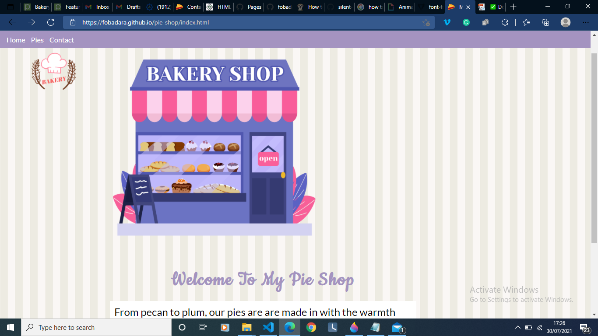

# pie-shop

A site that takes your orders and gets your location (with your permission ofcourse)

Built With

● HTML

● CSS

● Javascript

● HTML and CSS Linters

# Getting Started

To get a local copy up and running follow these simple example steps.

⬜ clone the app by running this command `git clone https://github.com/fobadara/pie-shop.git`

⬜ Run this command `cd pie-shop`

⬜ Open in browser

# Prerequisites

You will be needing:

⬜ A web browser to view output

⬜ A text editor or terminal

# Run tests

You can run tests by following these steps:

⬜ commit and push your changes

⬜ navigate to pull request

⬜ I have created a pull request which runs linters or you could simply create a pull request of your own

# Authors

👤 Abdulfatai Badara

GitHub: github.com/fobadara

Twitter: fob90s@twitter.com

🤝 # Contributing 

Contributions, issues, and feature requests are welcome!

Feel free to check the issues page.

# Show your support

Give a ⭐️ if you like this project!

# Acknowledgments

Hat tip to anyone whose code was used

A big thank you to pngtree whose images have been used:

⬜ purple PNG Designed By CHENXIN from https://pngtree.com/freepng/purple-bakery-clip-art_5894548.html?sol=downref&id=bef

⬜ features PNG Designed By CHENXIN from https://pngtree.com/freepng/featured-orange-bakery-clip-art_5894553.html?sol=downref&id=bef

Lots of appreciations to my wife, Habeebah who keeps supporting me

📝 # License 

This project is licensed by [MIT](LICENSE)
